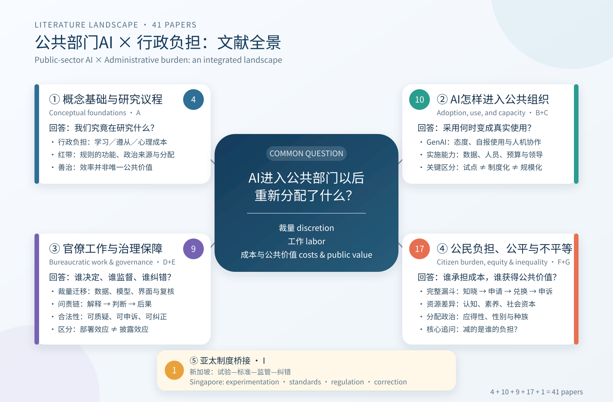
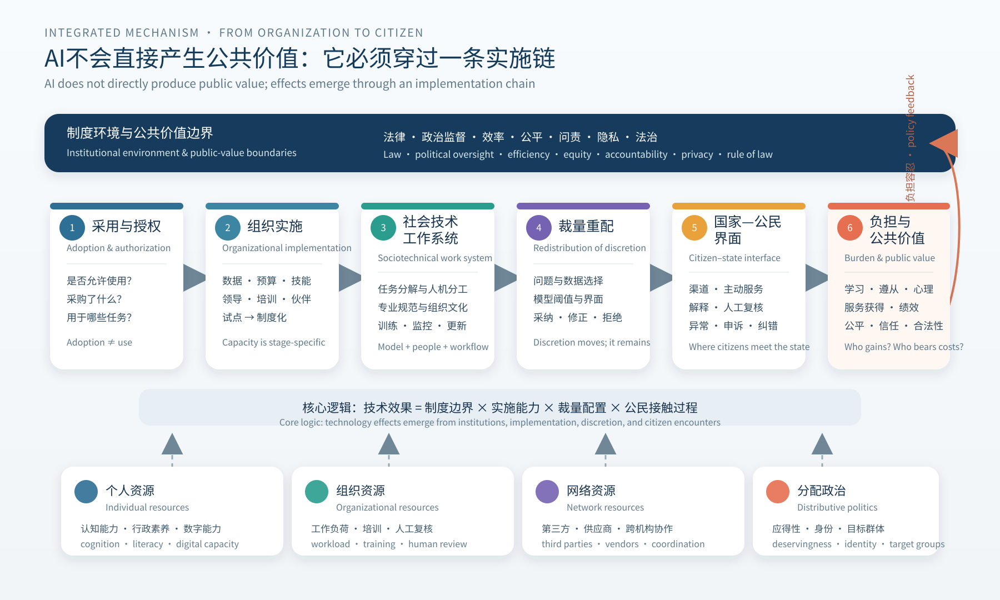
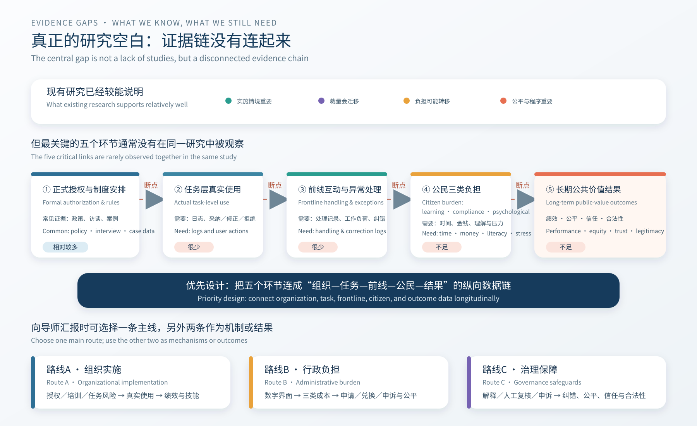

# 41篇文献思维导图与研究框架 | Visual Frameworks for the 41-Paper Corpus

> 新版设计原则：一张图只回答一个问题。图1帮助理解文献版图，图2解释理论机制，图3把证据空白转化为可与导师讨论的研究设计。  
> Design principle: one question per figure. Figure 1 organizes the literature, Figure 2 explains the mechanism, and Figure 3 translates evidence gaps into research designs.

## 图1　文献全景：五个问题模块，而不是八个孤立分类

[打开高清PNG / Open high-resolution PNG](visuals/01_literature_landscape_bilingual.png)

### 这张图回答什么？ | What Does This Figure Answer?

八个原始分类被重新组织为五个问题模块：

1. **概念基础（A，4篇）**：行政负担、红带和善治价值提供共同语言。
2. **AI进入组织（B+C，10篇）**：区分采用、真实使用、制度化和规模化。
3. **官僚工作与治理（D+E，9篇）**：解释裁量迁移，以及谁能够解释、监督和纠错。
4. **公民负担与公平（F+G，17篇）**：追踪学习、遵从和心理成本由谁承担，以及公共价值如何分配。
5. **亚太制度桥接（I，1篇）**：用新加坡连接试验、标准、政策能力与监管纠错。

The eight original categories are reorganized into five problem-oriented modules: conceptual foundations; organizational entry and implementation; bureaucratic work and governance; citizen burden and equity; and an Asia-Pacific institutional bridge.

### 导师汇报的一句话 | One-Sentence Takeaway

> 这41篇不是两组分离的“AI文献”和“行政负担文献”，而是在共同解释：AI进入公共部门以后，怎样重新分配裁量、工作、成本与公共价值。

> The 41 studies are not separate AI and administrative-burden literatures; together they explain how AI redistributes discretion, labor, costs, and public value after entering the public sector.

## 图2　整合机制：AI必须穿过实施链，才会影响公民结果

[打开高清PNG / Open high-resolution PNG](visuals/02_integrated_mechanism_bilingual.png)

### 主因果链 | Main Analytical Chain

`制度与公共价值边界 → 采用与授权 → 组织实施 → 社会技术工作系统 → 裁量重配 → 国家—公民界面 → 行政负担与公共价值`

`Institutional and public-value boundaries → adoption and authorization → organizational implementation → sociotechnical work system → redistribution of discretion → citizen–state interface → administrative burden and public value`

### 四类条件 | Four Conditioning Factors

- **个人资源**：认知、行政素养和数字能力。
- **组织资源**：工作负荷、培训与人工复核。
- **网络资源**：第三方、供应商和跨机构协作。
- **分配政治**：应得性、身份和目标群体建构。

Individual, organizational, network, and political resources determine how the same technological arrangement affects different organizations and social groups.

### 这张图不能被误读为什么 | What the Figure Does Not Claim

- 箭头表示需要研究的理论关系，不表示41篇已经共同识别完整因果链。
- 组织“采用AI”不等于员工真实使用，更不等于公民结果改善。
- 行政负担可能下降、上升或从政府转移给公民和第三方。
- 技术准确率不能替代公平、问责、隐私、申诉和合法性结果。

The arrows identify theoretical relationships to be tested; they do not imply that the entire causal chain has already been identified.

## 图3　证据空白：缺的不是更多态度调查，而是连起来的数据

[打开高清PNG / Open high-resolution PNG](visuals/03_evidence_gaps_agenda_bilingual.png)

### 现有证据较能支持什么？ | What Is Relatively Well Supported?

- 组织情境和实施安排是AI后果的一部分，而不只是控制变量。
- AI重新配置裁量与工作，不会自动消除人类角色。
- 数字化既可能减负，也可能制造或转移负担。
- 公平、程序权利和问责会影响官僚与公民评价。

Existing evidence relatively consistently supports the importance of implementation context, the relocation of discretion, the possible transfer of burden, and the relevance of equity and procedural safeguards.

### 证据链断在哪里？ | Where Does the Evidence Chain Break?

现有研究很少在同一设计中连接：

`正式授权 → 任务层真实使用 → 前线互动与异常处理 → 公民三类负担 → 长期绩效、公平、信任与合法性`

Most studies observe only one part of the chain rather than connecting formal authorization, task-level use, frontline handling, citizen costs, and long-term public-value outcomes.

### 与导师讨论的三条路线 | Three Routes for Advisor Discussion

| 路线 | 主问题 | 关键数据 | 核心贡献 |
|---|---|---|---|
| A. 组织实施 | 正式支持怎样转化为真实使用？ | 政策、培训、任务日志、产出质量、错误 | 从采用意愿推进到采用后的公共价值 |
| B. 行政负担 | AI怎样在政府、公民和第三方之间转移成本？ | 服务漏斗、时间、材料、压力、帮助与申诉 | 从“是否减负”推进到“谁的负担怎样变化” |
| C. 治理保障 | 解释、复核与申诉能否改善纠错和合法性？ | 分阶段上线或实验、错误、程序公平、信任 | 把负责任AI原则转化为可检验制度设计 |

| Route | Main question | Key data | Contribution |
|---|---|---|---|
| A. Implementation | How does formal support become actual use? | Policies, training, task logs, quality, errors | From adoption intention to post-adoption public value |
| B. Administrative burden | How does AI redistribute costs among government, citizens, and third parties? | Service funnel, time, documents, stress, assistance, appeals | From whether burden declines to whose burden changes |
| C. Governance safeguards | Do explanation, review, and appeal improve correction and legitimacy? | Staggered rollout or experiment, errors, procedural fairness, trust | Turn responsible-AI principles into testable institutional design |

## 最推荐的汇报顺序 | Recommended Presentation Order

1. 用图1在两分钟内说明“41篇共同研究什么”。
2. 用图2说明你的核心理论判断：AI通过实施链而非直接产生结果。
3. 用图3说明研究空白，并请导师在A、B、C三条路线中帮助确定主线。

Use Figure 1 to establish the landscape, Figure 2 to explain the theoretical mechanism, and Figure 3 to convert the gap into a concrete advisor decision.
